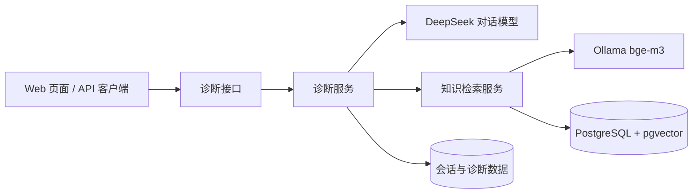

# Spring Agent

Spring Agent 是一个面向 Java 与 Spring 项目升级场景的智能诊断助手。项目基于 Spring Boot 和 Spring AI，将大模型流式生成、RAG 知识检索、会话持久化与简单的 Web 调试界面组合在一起，用于分析升级问题并给出迁移建议。

## 主要功能

- **流式升级诊断**：通过 DeepSeek 模型生成诊断结果，并使用 SSE 实时返回内容。
- **RAG 知识增强**：使用 Ollama `bge-m3` 生成向量，通过 PostgreSQL + pgvector 检索 Spring 官方迁移资料。
- **多轮会话**：保存用户问题、模型回复和消息状态，支持按会话继续追问。
- **统一响应协议**：普通接口使用统一 JSON 响应体，流式接口依次发送 `meta`、`chunk`、`done` 或 `error` 事件。
- **诊断数据模型**：已提供风险、兼容性问题、修改建议、知识证据和升级步骤等持久化结构。
- **内置调试页面**：应用启动后可直接在浏览器中进行流式对话测试。

## 系统架构



## 技术栈

| 技术 | 用途 |
| --- | --- |
| Java 17 | 运行时与开发语言 |
| Spring Boot 3.5 | Web 应用基础框架 |
| Spring AI 1.1 | 对话模型、嵌入模型和向量数据库集成 |
| DeepSeek | 流式诊断内容生成 |
| Ollama + bge-m3 | 本地文本向量化 |
| PostgreSQL + pgvector | 业务数据和知识向量存储 |
| MyBatis-Plus | 数据访问 |
| StringTemplate | 诊断提示词模板 |
| Docker Compose | 本地基础设施编排 |

## 环境要求

- JDK 17 或更高版本
- Maven 3.9 或更高版本
- Docker 与 Docker Compose
- 可用的 DeepSeek API Key

## 快速开始

### 1. 克隆项目

```bash
git clone https://github.com/buyaomaicai/springagent.git
cd springagent
```

### 2. 启动 PostgreSQL 和 Ollama

PowerShell：

```powershell
Copy-Item deploy/.env.example deploy/.env
docker compose --env-file deploy/.env -f deploy/docker-compose.yml up -d postgres ollama
docker exec spring-agent-ollama ollama pull bge-m3
```

Docker Compose 会自动执行 `deploy/postgres/init/` 下的脚本，创建业务表并启用 pgvector 扩展。

### 3. 初始化本地测试会话

当前开发版本使用固定的本地测试用户。进入 PostgreSQL：

```powershell
docker exec -it spring-agent-postgres psql -U spring_agent -d spring_agent
```

执行以下 SQL，使内置调试页面可以直接发起会话：

```sql
INSERT INTO app_user (id, external_subject, display_name)
VALUES (
    '123e4567-e89b-12d3-a456-426614174000',
    'local-dev',
    '本地开发用户'
)
ON CONFLICT (id) DO NOTHING;

INSERT INTO chat_conversation (id, user_id, title)
VALUES (
    '00000000-0000-0000-0000-000000000101',
    '123e4567-e89b-12d3-a456-426614174000',
    '本地测试会话'
)
ON CONFLICT (id) DO NOTHING;
```

输入 `\q` 退出 PostgreSQL。

### 4. 配置并启动应用

```powershell
$env:DEEPSEEK_API_KEY = "你的 DeepSeek API Key"
mvn spring-boot:run
```

默认地址：

- 调试页面：<http://localhost:8080/>
- 健康检查：<http://localhost:8080/diagnosis/health>
- Swagger UI：<http://localhost:8080/swagger-ui/index.html>

## 调用诊断接口

使用 PowerShell 调用 SSE 流式接口：

```powershell
curl.exe -N http://localhost:8080/diagnosis/stream `
  -H "Content-Type: application/json" `
  --data-binary '{"conversationId":"00000000-0000-0000-0000-000000000101","input":"将 Spring Boot 2.7 升级到 3.0 需要注意什么？"}'
```

接口会按顺序返回以下事件：

| 事件 | 说明 |
| --- | --- |
| `meta` | 协议版本、请求标识和会话信息 |
| `chunk` | 模型生成的文本片段 |
| `done` | 本次诊断完成 |
| `error` | 诊断失败，包含错误码和是否可重试 |

## API 概览

| 方法 | 路径 | 说明 |
| --- | --- | --- |
| `GET` | `/diagnosis/health` | 检查诊断服务状态 |
| `POST` | `/diagnosis/stream` | 发起流式升级诊断 |
| `POST` | `/project-artifacts/pom` | 上传并解析 Maven `pom.xml` |
| `GET` | `/admin/message` | 查询用户及其会话列表 |
| `GET` | `/admin/message/detail/{id}` | 查询指定用户的会话与消息 |

诊断请求体：

```json
{
  "conversationId": "00000000-0000-0000-0000-000000000101",
  "input": "将 Spring Boot 2.7 升级到 3.0 需要注意什么？"
}
```

`input` 必填；`conversationId` 用于关联已有会话。

上传 POM 时使用 `multipart/form-data`，文件字段名固定为 `file`：

```powershell
curl.exe http://localhost:8080/project-artifacts/pom `
  -F "file=@pom.xml;type=application/xml"
```

接口会返回项目坐标、Java 与 Spring Boot 版本、直接依赖、模块以及解析 warning。单个 POM
最大为 1 MiB；格式错误、不安全 XML 和超大文件均使用统一错误响应返回。

## 配置说明

应用配置位于 `src/main/resources/application.yml`，常用环境变量如下：

| 环境变量 | 是否必填 | 默认值 | 说明 |
| --- | --- | --- | --- |
| `DEEPSEEK_API_KEY` | 是 | 无 | DeepSeek API 密钥 |
| `DB_URL` | 否 | `jdbc:postgresql://localhost:5432/spring_agent` | PostgreSQL JDBC 地址 |
| `DB_USERNAME` | 否 | `spring_agent` | 数据库用户名 |
| `DB_PASSWORD` | 否 | `spring_agent_dev` | 数据库密码 |
| `OLLAMA_BASE_URL` | 否 | `http://localhost:11434` | Ollama 服务地址 |

生产环境请务必通过环境变量注入密钥和数据库密码，不要将真实凭据提交到仓库。

## 知识库

`knowledge-base/sources.yml` 记录了 Spring Boot、Spring Framework、Spring Security 和 JDK 官方资料来源。原始文档位于被 Git 忽略的 `knowledge-base/raw/`，以便保留来源信息且避免将抓取内容直接提交到仓库。

当前 Spring Boot 3.0 导入流程需要以下文件：

```text
knowledge-base/raw/spring-boot-wiki/Spring-Boot-3.0-Migration-Guide.asciidoc
```

准备好该文件并启动 PostgreSQL、Ollama 后，可通过集成测试执行导入和检索验证：

```powershell
mvn -Dtest=RagTests#testKnowledge test
```

`knowledge-base/tools/fetch-official-docs.mjs` 可用于抓取允许列表内的 Spring Security 和 Oracle JDK 官方 HTML 文档。详细约束见 `knowledge-base/README.md`。

## 项目结构

```text
spring-agent/
├── deploy/                         # Docker Compose 与数据库初始化脚本
├── knowledge-base/                 # 知识来源清单和抓取工具
├── src/main/java/com/springagent/
│   ├── ai/                         # Agent 与提示词策略
│   ├── common/                     # 公共配置、响应、异常和持久化工具
│   ├── diagnosis/                  # 诊断接口、服务、实体和 Mapper
│   ├── knowledge/                  # 知识导入、检索及文档客户端
│   ├── parser/                     # POM、依赖列表和错误日志解析
│   └── report/                     # 升级计划生成
├── src/main/resources/
│   ├── mapper/                     # MyBatis XML Mapper
│   ├── prompts/                    # StringTemplate 提示词
│   └── static/                     # 内置 Web 调试页面
└── src/test/java/                  # JUnit 5 测试
```

## 构建与测试

```powershell
# 运行测试（RAG 集成测试需要 PostgreSQL、Ollama 和本地知识文档）
mvn test

# 完整校验并打包
mvn clean verify

# 生成可执行 JAR
mvn package
```

构建产物位于 `target/` 目录。

## 参与开发

提交代码前请运行相关测试，并确保没有提交 API Key、`deploy/.env`、本地知识库原文或 `target/` 构建产物。建议使用简短、明确的提交信息，例如：

```text
feat(diagnosis): persist streamed responses
fix(parser): reject malformed pom XML
```
